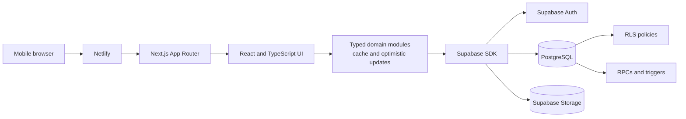
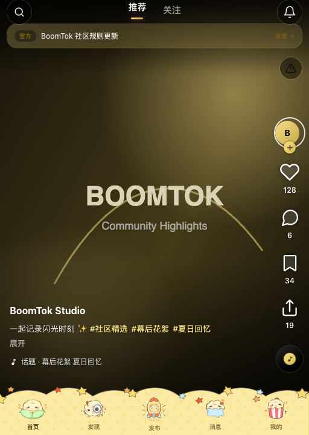
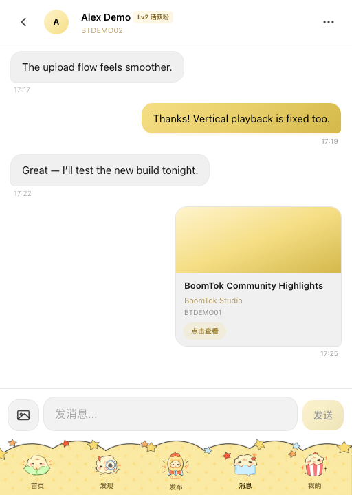
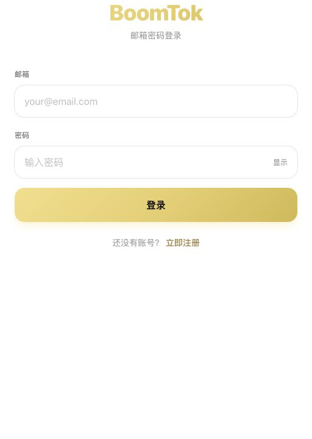

# BoomTok

**Private-source portfolio showcase · Active beta · May 2026 – Present**

BoomTok is a mobile-first short-video fan community for video sharing, social interaction, private messaging, content moderation, and fan engagement.

> This repository documents the product and my engineering contributions. The application source code, production configuration, internal handoff documents, and user data remain private because BoomTok is an active team project.

## Project Overview

BoomTok combines a vertical short-video experience with media uploads, likes, comments, follows, private messaging, notifications, moderation tools, fan communities, and a server-authoritative rewards marketplace.

At the project level, the current application spans **42 Next.js App Router pages** and **126 React components**, with a Supabase/PostgreSQL backend supporting authentication, cloud media, social relationships, messaging, moderation, and virtual assets.

| | |
|---|---|
| **Status** | Beta deployment with small-group usability testing |
| **Team** | Approximately five contributors |
| **My role** | Full-Stack Developer |
| **Technology** | Next.js 15, React 19, TypeScript, Tailwind CSS, Supabase, PostgreSQL, Netlify |

## My Contributions

- Implemented much of the core short-video experience, including cloud media uploads, vertical playback, and related interaction workflows.
- Built foundational private-messaging and social-conversation features.
- Managed Supabase-backed data and media workflows, Netlify production deployments, and the Git/GitHub release process.
- Diagnosed playback races, stale optimistic updates, cross-account cache behavior, cloud synchronization issues, and deployment regressions found during small-group testing.
- Collaborated with an approximately five-person team on feature design, implementation, integration, and debugging.

## Key Product Capabilities

- Vertical short-video feed with upload, playback, likes, comments, follows, favorites, sharing, and discovery
- Supabase Auth, PostgreSQL, and Storage-backed user and media data
- Private messaging, notifications, blocking, reporting, and moderation
- Fan topics, activities, creator tools, and administrative workflows
- Server-authoritative rewards wallet, append-only ledger, daily tasks, and virtual-item marketplace
- Responsive mobile interface tested across common phone and tablet viewport widths

## Architecture

## Engineering Highlights

- Stabilized video playback with active-player gating, persistent playback URLs, and browser race-condition handling.
- Used optimistic updates, mutation versions, ordered writes, and cloud reconciliation to prevent stale responses from replacing newer state.
- Enforced identity, ownership, blocking, moderation, and virtual-asset rules through PostgreSQL RLS, RPCs, triggers, and server-side validation.
- Validated key workflows through type checking, production builds, multi-account testing, responsive regression checks, and deployment verification.

## Product Walkthrough

<table>
  <tr>
    <td align="center" width="50%">
       
      <strong>Video feed</strong> — vertical playback, creator context, and social interactions
    </td>
    <td align="center" width="50%">
       
      <strong>Messaging</strong> — one-to-one conversation and video sharing using synthetic demo data
    </td>
  </tr>
  <tr>
    <td align="center" width="50%">
       
      <strong>Discovery hub</strong> — search, announcements, support, and featured activities
    </td>
    <td align="center" width="50%">
       
      <strong>Fan communities</strong> — topic-based discovery and participation
    </td>
  </tr>
  <tr>
    <td align="center" colspan="2">
       
      <strong>Authentication</strong> — branded Supabase email and password entry
    </td>
  </tr>
</table>

All screenshots use anonymous routes or synthetic demo accounts and data. The messaging image contains a fabricated conversation created specifically for this public showcase. No real credentials, user conversations, notifications, storage URLs, or administrative records are shown.

## Source and Usage

The production repository is private. This showcase intentionally contains no application source, database migrations, environment variables, deployment identifiers, test credentials, or user data.

All product descriptions and diagrams in this repository are provided for portfolio review. No license to reuse the private application or its assets is granted.

## Contributor

Jerry Jin · Full-Stack Developer · [LinkedIn](https://www.linkedin.com/in/guo-j-996344295/)
